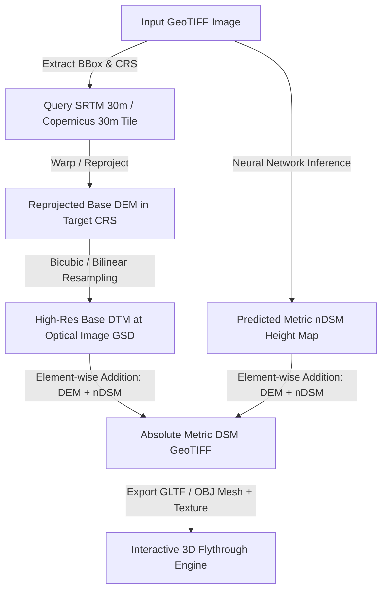

# DepthWizard (SIH26175) — Geospatial & SRTM Calibration Technical Note
**Author:** Player 2 (Data & Geospatial Engineer)  
**Role:** Geospatial Prerequisite & Scale Calibration Architecture  
**Target:** AI/ML Team (Player 1) & 3D Flythrough Visualization Team (Player 3)

---

## 1. Executive Summary & Problem Context

The core challenge of Problem Statement **SIH26175 (ISRO / Department of Space)** is single-view height estimation and 3D terrain flythrough. 

Monocular depth models (such as Depth Anything, RDAH-Net, DPT) trained on optical satellite imagery natively predict **relative Normalized Digital Surface Model ($\text{rDSM}$)** or scale-agnostic normalized heights.

To transition from scale-agnostic relative depth to metric Digital Surface Models ($\text{DSM}$), the system must handle two operational modes:
1. **Non-Georeferenced Imagery (`.png`, `.jpg`):** Outputs relative height ($\text{rDSM}$) for direct mesh extrusion in the 3D rendering engine.
2. **Georeferenced Satellite Imagery (`.tif`, GeoTIFF):** Ingests spatial metadata (CRS, bounds, GSD), aligns with a low-resolution global base elevation model (e.g., **SRTM 30m / Copernicus GLO-30 DEM**), estimates the absolute scale factor $s$ and offset $b$, and synthesizes an **Absolute Digital Surface Model ($\text{DSM}_{\text{absolute}}$)** in metric units.

---

## 2. Mathematical Calibration Framework

### 2.1 Definitions
- $\text{DTM}(x, y)$ or $\text{DEM}(x, y)$: **Digital Terrain / Elevation Model** — Bare-earth ground elevation above sea level (WGS84 / EGM96 geoid).
- $\text{nDSM}(x, y)$ or $\text{AGL}(x, y)$: **Normalized Digital Surface Model / Above Ground Level** — Object height above local terrain (buildings, trees, structures: $h \ge 0$).
- $\text{DSM}(x, y)$: **Digital Surface Model** — Total elevation including surface objects:
$$\text{DSM}_{\text{absolute}}(x, y) = \text{DTM}_{\text{base}}(x, y) + \text{nDSM}_{\text{metric}}(x, y)$$

### 2.2 Calibration from Optical Model Predictions
When the neural network outputs predicted height $\hat{h}_{\text{pred}}(u, v)$ for pixel $(u, v)$:
1. **Direct Metric Mode (if network is calibrated directly on metres):**
   $$\text{DSM}(u, v) = \text{DEM}_{\text{SRTM}}(u, v) + \max(0, \hat{h}_{\text{pred}}(u, v))$$
2. **Relative-to-Absolute Affine Scale Mapping (using SRTM ground reference or GCPs):**
   $$\hat{h}_{\text{metric}}(u, v) = s \cdot \hat{h}_{\text{pred}}(u, v) + b$$
   Where $s$ and $b$ are determined by matching predicted ground regions ($\text{CLS} = \text{Ground/Road}$) to local DEM slope or known Ground Control Points (GCPs).

---

## 3. GeoTIFF Spatial Metadata Requirements

When a user uploads a GeoTIFF, Player 2's geospatial ingestion module must extract:

| Metadata Field | Geospatial Meaning | Application in DepthWizard Pipeline |
|---|---|---|
| **CRS / EPSG Code** | Coordinate Reference System (e.g., EPSG:32618 UTM Zone 18N or EPSG:4326 WGS84) | Determines if coordinates are projected (metres) or geographic (degrees). |
| **Affine Transform** | $[x_{\text{min}}, \Delta x, 0, y_{\text{max}}, 0, -\Delta y]$ | Maps pixel coordinates $(u, v)$ to real-world geospatial coordinates $(x, y)$. |
| **GSD (Resolution)** | Ground Sampling Distance in metres/pixel (e.g., $0.3\text{m}, 0.5\text{m}, 1.0\text{m}$) | Essential for converting horizontal footprint and aspect ratios in 3D terrain meshes. |
| **Bounding Box (BBox)** | $[x_{\text{min}}, y_{\text{min}}, x_{\text{max}}, y_{\text{max}}]$ | Used to query and clip the corresponding bounding box from SRTM / Copernicus DEM tiles. |
| **NoData Value** | Masking value for missing / invalid imagery border pixels | Prevents distortion in depth inference at satellite swath boundaries. |

---

## 4. SRTM DEM Ingestion & Resampling Workflow

### Key Technical Considerations:
1. **Resolution Mismatch:** Optical satellite imagery typically has high resolution ($\le 0.5\text{m}$ to $1.0\text{m}$ GSD), while SRTM is $30\text{m}$ (1 arc-second). High-frequency elevation (individual buildings, roofs, tree crowns) comes from the predicted nDSM, while low-frequency base topography comes from the upsampled SRTM DEM.
2. **Reprojection:** Both rasters must be warped to the same Projected Coordinate System (e.g., UTM Zone) so pixel dimensions correspond to square metres.
3. **NoData Propagation:** SRTM ocean/void pixels (usually `-32768` or `NaN`) must be filled via bilinear interpolation or masked cleanly.

---

## 5. Recommended Geospatial Python Stack

| Tool / Library | Role in DepthWizard | Justification / Trade-offs |
|---|---|---|
| **`rasterio`** | GeoTIFF I/O, CRS metadata, affine transforms, windowed reading | Industry-standard, fast C-GDAL bindings, lightweight memory footprint. |
| **`pyproj`** | Geodetic projections, EPSG coordinate transformations | High-precision Cartographic projection engine (PROJ.org). |
| **`scipy` / `numpy`** | Bilinear / bicubic resampling, raster arithmetic | Ultra-fast vector operations for DEM + nDSM tensor blending. |
| **`shapely`** | Vector boundary calculations and spatial indexing | Lightweight polygon math for image footprints. |
| **`rioxarray`** *(Optional)* | Multi-dimensional xarray raster processing | Useful for batch multi-temporal rasters, but `rasterio` + `numpy` is sufficient and lighter. |
| **`QGIS`** *(Verification)* | Desktop GIS validation tool | Visual ground-truthing of generated DSM GeoTIFFs against real LiDAR basemaps. |

---

## 6. Actionable Interface Protocol for AI/ML (Player 1)

1. **Input to ML Model:** 3-channel RGB image tensor $(B, 3, H, W)$ normalized $[0, 1]$ or ImageNet standardized.
2. **Output from ML Model:** 1-channel nDSM tensor $(B, 1, H, W)$ in non-negative metric scale (metres).
3. **Player 2 Wrapper:** 
   - Reads input GeoTIFF metadata.
   - Passes RGB to Player 1 model.
   - Receives nDSM.
   - Fetches and resamples local SRTM tile.
   - Computes $\text{DSM} = \text{SRTM}_{\text{resampled}} + \text{nDSM}$.
   - Writes output georeferenced GeoTIFF (`.tif`) preserving original CRS, transform, and extent.
